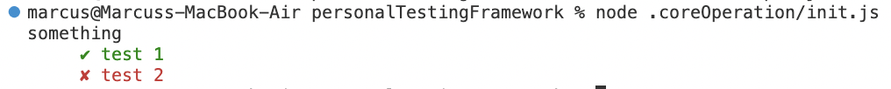

## Getting Started

```javascript
group("something",()=>{
    spec("test 1",()=>{
        const hi = 1;
        const bye = 1;
        expect(hi).toBe(bye)
    })
    spec("test 2",()=>{
        const hi = 1;
        const bye = 2;
        expect(hi).toBe(bye)
    })
})
```


## Improvements
- [] Specify the reason for failed test